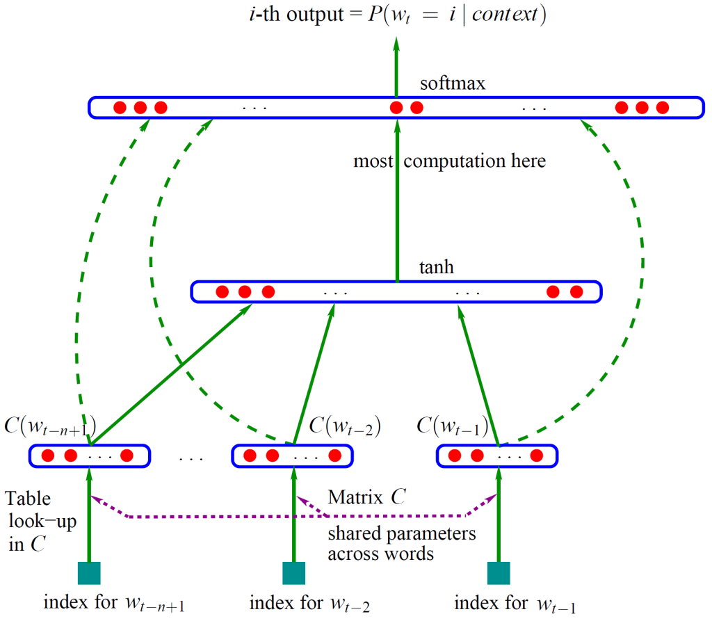

---
 
 layout: post
 title: 语言模型
 subtitle: ""
 date: 2017-09-22 
 author: abelx 
 category: NLP
 tags: NLP
 finished: true 
 
--- 

总结一下NLP中的语言模型。
## 基本模型n-gram
语言模型其实就是看一句话是不是正常人说出来的。语言模型形式化的描述就是给定一个字符串，看它是自然语言的概率。

$s=w_1w_2...w_m$
s表示句子，$w_i$表示词。
$p(s)=p(w_1w_2...w_m)=p(w_1)p(w_2|w_1)p(w_3|w_1w_2)...$
句子的概率等于所有词的联合概率。
### 问题
第k词依赖前边k-1词，参数过多。
### 解决办法
减少依赖词数，假设第k词仅仅依赖前边n-1词，得到的模型就是n-gram模型。

### 应用
- 输入法，给定拼音串，有多个可能的汉字串，套模型，概率最大的句子就是结果。
- 汉语分词，给定汉字串，有多个可能的分词结果，求使句子概率最大的分词结果。
- 语音识别，

### 参数估计
最大似然。

比如2-gram，估计$p(w_i|w_{i-1})$，分子是$\#(w_{i-1}, w_i)$(表示这个二元组出现的次数)，分母是$\sum_k\#(w_{i-1}, w_k)$(表示所有以$w_{i-1}$开头的二元组出现的次数)。

数据稀疏引起零概率问题：数据平滑。

#### 数据平滑
基本思想：调整最大似然估计的结果，使得零概率增大，非零概率减小，劫富济贫。

基本目标：测试样本的语言模型困惑度越小越好。

基本约束： 概率和为1.

- 加一法

	分子加1，分母加N，N是词典大小
- Good-Turing法
- katz后退法

	如果N元的概略找不到，那就用N-1元的概率乘上一个权重来模拟。

### 语言模型的自适应
- 基于缓存的语言模型

	在文本中刚刚出现过得词在后边的句子中再次出现的肯能行往往较大。概率通过对n-gram线性插值求得。
- 基于混合方法的语言模型
- 基于最大熵的语言模型

## 神经网络语言模型
### n-gram模型的问题
1. 数据稀疏，语料不足使得无法训练高阶模型，无法建模更远的关系。
2. 无法建模出词之间的相似度。

### word embedding(词向量)
传统表示方法是词典+one-hot表示，分布式表示是把每个词表示成一个低维向量。

### 词向量的训练
[一篇讲词向量的非常好的博文](http://licstar.net/archives/328)
> 到目前为止我了解到的所有训练方法都是在训练语言模型的同时，顺便得到词向量的。

通过Bengio的模型简单说明一下原理。

Bengio 用了一个三层的神经网络来构建语言模型，如下图：

这个模型同样是一个 n-gram 语言模型，他的目标是计算$p(w_j|w_{j-n+1}w_{j-n+2}...w_{j-1})$。所以，输入是前n-1个词向量，输入神经元数是(n-1)*m（m是词向量的维度），输出神经元数是|V|，|V|表示词汇表大小，每个输出神经元的输出就是他所代表的单词在当前上下文后出现的概率$p(w_j|w_{j-n+1}w_{j-n+2}...w_{j-1})$。

用随机梯度下降法把这个模型优化出来就可以了。需要注意的是，一般神经网络的输入层只是一个输入值，而在这里，输入层的向量也是参数也是需要优化的。优化结束之后，词向量有了，语言模型也有了。

